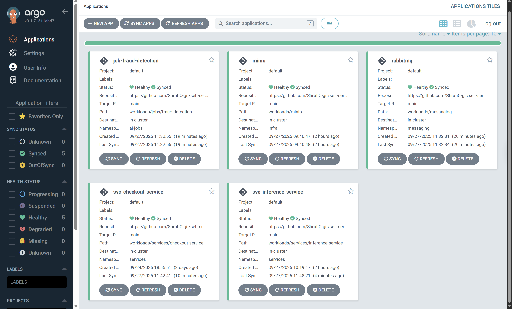

# Self-Service, Golden Path for AI/ML and Microservices

- [Self-Service, Golden Path for AI/ML and Microservices](#self-service-golden-path-for-aiml-and-microservices)
  - [Introduction](#introduction)
  - [Why I Built This](#why-i-built-this)
  - [What I Built](#what-i-built)
  - [Workflow and Orchestration](#workflow-and-orchestration)
  - [Developer Experience: Fraud Detection Example](#developer-experience-fraud-detection-example)
    - [1. Checkout Service (Backend Service)](#1-checkout-service-backend-service)
    - [2. Fraud Trainer (ML Job)](#2-fraud-trainer-ml-job)
    - [3. Fraud Inference Service (Model Inference Backend)](#3-fraud-inference-service-model-inference-backend)
  - [Guardrails and Extensibility](#guardrails-and-extensibility)
  - [Architecture](#architecture)
  - [Tech Stack](#tech-stack)
  - [Outcome](#outcome)
  - [Next Steps](#next-steps)


## Introduction  
I built this project to address a gap I noticed in most self-service platforms. They make it easy for backend developers to deploy services, but they rarely account for the very different needs of AI and ML jobs. 

My goal was to design a golden path that unifies both: backend services and AI/ML jobs/workloads. The idea is simple: developers and ML engineers should be able to push their code, and the platform should take care of the infrastructure, policies, deployments, patches, and of course, integrations with each other and other tools/services. Most importantly, an easy, unified self-service workflow. 

## Why I Built This  
In most setups, "self-service" almost invariably imply platform for efficiently deploying/managing backend-systems. Developers can push their code, rely on GitOps for delivery, and see their service running without touching infrastructure.

However, from my observation, AI/ML jobs are left behind.But these jobs bring a set of challenges that backend apps do not:  

- Resource-intensive training and inference runs that need strict policy enforcement to avoid wasting capacity  
- Persistent storage requirements for datasets, models, and artifacts (stateless services can work without one) 
- Integration with messaging systems such as RabbitMQ for event-driven pipelines (primarily for scale) 
- The need for reproducibility across environments (deployment and dev-environments), where feature engineering and models must be portable and consistent  

I found that ML engineers often had to stitch together fragile workflows by hand, while backend developers enjoyed smooth GitOps pipelines. This created wasted resources, slower delivery, and silos between models and the services that consume them.  

I built this project to close that gap. It provides a self-service golden path for both AI/ML jobs and backend services, provisioning infrastructure, enforcing guardrails, and connecting services and models seamlessly. This allows app-developers and AI/ML engineers to focus on writing code while the platform takes care of orchestration.  

## What I Built  
The system creates a self-service workflow where developers and ML engineers only need to write their code and Dockerfile. Once they push to GitHub, the platform provisions everything else: infrastructure, policy enforcement, storage, and deployment.  

There is a clear separation of concerns between backend services and ML jobs, since each requires a different architecture. Terraform provisions and manages both common and specific infrastructure:  

- Common infrastructure such as the Kubernetes cluster (this is built on KinD), network connectivity, and shared storage volumes (used by both ML training jobs and inference services)  
- Service-specific infrastructure such as roles, service accounts, namespaces, and compute boundaries for jobs and services  
- External dependencies such as RabbitMQ for event-driven communication  
- Policies-as-code with Kyverno to ensure that workloads always have proper limits and guardrails, specially the ML jobs which can lead to costs overrun

With this setup, infrastructure is reproducible, secure, and dynamically provisioned, while developers and ML engineers can focus on their applications.  

## Workflow and Orchestration  
The workflow combines Kustomize, GitHub Actions, Terraform, and ArgoCD in a GitOps-first approach.  

1. **Kustomize** provides boilerplate templates for both ML jobs and services. These templates are patched dynamically during CI runs.  
2. **GitHub Actions** builds Docker images from the developer’s Dockerfile, pushes them to a registry, updates the Kustomize manifest with the new image, and commits the manifest to the GitOps repo.  
3. **ArgoCD** continuously watches the GitOps repo. Using ApplicationSets, it deploys workloads into the correct namespace:  
   - ML jobs into the `ai-jobs` namespace as Kubernetes BatchJobs  
   - Backend services into the `services` namespace as Deployments and Services  
   > ArgoCD also manages RabbitMQ and storage deployments.  
4. **Terraform** provisions the underlying infrastructure, including secrets, namespaces, MinIO for persistent storage, and Kyverno for policy enforcement.  

This ensures that every push flows from code to deployment with no manual intervention.  

## Developer Experience: Fraud Detection Example 

To demonstrate the platform, I built an fraud detection workflow, where the backend services are closely integrated with the ML model created by the ML job. 

This is the main repo, where ArgoCD is watching for any pushes to the [workloads/services](https://github.com/ShrutiC-git/self-service-with-argo/tree/main/workloads/services) path and the [workload/jobs](https://github.com/ShrutiC-git/self-service-with-argo/tree/main/workloads/jobs/fraud-detection) path. As soon as any changes are made, ArgoCD, deployed in the K8s cluster, will poll the changes, and sync the state of job/service to match the desired state in the GitOps repo.  



### 1. [Checkout Service](https://github.com/ShrutiC-git/go-k8s-service-with-kustomize) (Backend Service)  
- Written in Go  
- Receives transaction requests containing a `userId` and an `amount` for which the transaction was made
- Calls the `Fraud Inference` service to predict whether the transaction is fraudulent 
- Publishes transaction events to RabbitMQ  
- Deployed as a Kubernetes Deployment with a Service in the `services` namespace  
- [Deployed by ArgoCD services ApplicationSet](https://github.com/ShrutiC-git/self-service-with-argo/blob/main/argocd/apps/applicationsets/services-appset.yaml) after a push through GitHub Actions to this repo  

### 2. [Fraud Trainer](https://github.com/ShrutiC-git/python-ml-batchjob) (ML Job)
- Written in Python  
- Trains a fraud detection, logistic-regression model and saves it to MinIO-backed persistent storage  
- Deployed as a Kubernetes BatchJob in the `ai-jobs` namespace  
- Reads events from RabbitMQ and saves the model into MinIO  
- [Deployed by ArgoCD jobs ApplicationSet](https://github.com/ShrutiC-git/self-service-with-argo/blob/main/argocd/apps/applicationsets/jobs-appset.yaml) after a push through GitHub Actions to this repo

### 3. [Fraud Inference Service](https://github.com/ShrutiC-git/python-ml-inference) (Model Inference Backend)
- Written in Python  
- Loads the trained model from MinIO  
- Receives requests from the checkout service and responds with predictions (fraud or not)
- Runs continuously as a Kubernetes Deployment with a Service in the same namespace as the checkout service  
- [Deployed by ArgoCD services ApplicationSet](https://github.com/ShrutiC-git/self-service-with-argo/blob/main/argocd/apps/applicationsets/services-appset.yaml) after a push through GitHub Actions to this repo

> NOTE: The GitHub Actions workflow is nearly identical for [services](https://github.com/ShrutiC-git/go-k8s-service-with-kustomize/tree/main/.github/workflows) and [jobs](https://github.com/ShrutiC-git/python-ml-batchjob/tree/main/.github/workflows). The only difference is which template it applies from the GitOps repo: jobs use the BatchJob template, while services use the Deployment + Service template. This means developers can copy an existing workflow from another repo with minimal changes.  

## Guardrails and Extensibility  
Guardrails are built into the system to prevent misuse while keeping workflows flexible.  

- **Kyverno policies** ensure all workloads have defined requests and limits, preventing ML jobs from overusing cluster resources.  
- **Kustomize templating** allows ports, image, and other fields to be updated dynamically during CI runs.  
- **GitHub secrets and environment variables** are required for workflows, including secrets like Docker Hub credentials and environment-scoped variables such as namespaces and storage paths. **These must be set in each repository, keeping configuration secure and environment-specific.**

## Architecture  

```text
                +-------------------+                  +-------------------------+
                |  Checkout Service |                  |  Kyverno for enforcing  |
                |   (Go, Service)   |                  |     resource limits     |
                |    services ns    |                  |       kyverno ns        |
                +---------+---------+                  +-------------------------+
                          |
                          v
                   +-------------+
                   |  RabbitMQ   |
                   | messaging ns|
                   +------+------+ 
                          |
          +---------------+----------------+
          |                                |
          v                                v
+-------------------+             +-------------------+
| Fraud Trainer Job |             | Fraud Inference   |
| (Python, BatchJob)|             | Service (Python)  |
|     ai-jobs ns    |             |   services ns     |
+---------+---------+             +---------+---------+
          |                                 |
          v                                 |
   +-------------+                          |
   |    MinIO    |<-------------------------+
   |  (Storage)  |
   |   infra ns  |
   +-------------+
```

- Checkout Service publishes events to RabbitMQ  
- Fraud Trainer consumes events, trains model, and saves it to MinIO  
- Fraud Inference Service loads model from MinIO and serves predictions  
- Kyverno engorces resource requests and limits to resources across all namespaces

## Tech Stack  
- **Terraform** for provisioning clusters, namespaces, roles, storage, secrets, and policies  
- **ArgoCD** for GitOps-driven deployments and continuous delivery  
- **Kustomize** for templating Kubernetes manifests  
- **Kyverno** for policies-as-code  
- **GitHub Actions** for CI pipelines  
- **RabbitMQ** for event-driven messaging  
- **MinIO** for persistent storage  
- **Kubernetes** as the orchestration platform  

## Outcome  
This project showed me how self-service for ML jobs and backend services can be unified under one workflow. The fraud detection example demonstrates how developers and ML engineers can collaborate without worrying about infrastructure.  

## Next Steps
I plan to make this a more robust setup. Some next implementations:  
- Extending Kustomize overlays to handle dynamic resource limits at scale  
- Adding observability to track job runs and service health  
- Integrating Feast for reproducible ML pipelines  
- Exploring ephemeral environments that can self-destruct after use  